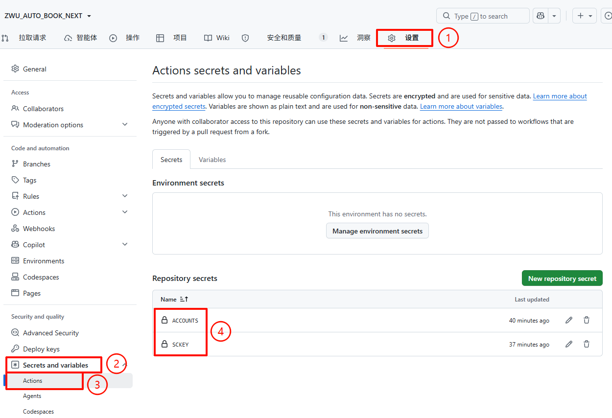

# ZWU AUTO BOOK NEXT — 浙江万里学院图书馆自动预约脚本

> ***"当笔墨铺就的栈道缓缓延伸，你伏案笃学沉淀的恒心自会成帆，载你走遍万里风光的求索征途。"***

> [!IMPORTANT]
> 请遵守以下使用协议，若不同意此协议，请移步其它项目
>
> <details><summary>使用协议</summary>
>
> - 本项目仅供学术交流使用，作者不对任何因使用本脚本造成的后果负责
> - 请合理使用，切勿占用公共资源（预约但不去签到等行为）
> - 滥用脚本可能导致封号、账号锁定等后果
> - 本项目将停止维护并将被移除，当发生以下情况之一:
>   - 本项目被浙江万里学院图书馆或校方要求删除
>   - 作者发现本项目影响到了图书馆正常的预约服务
>   - 作者发现本项目被滥用或有其他不妥之处
> - 当本项目被移除后，请各位使用者自觉停止使用 fork 的代码，以免造成不必要的麻烦。
>
> </details>

> [!NOTE]
> 本项目基于 [ZWU_AUTO_Booking](https://github.com/ZWUTA/ZWU_AUTO_Booking) 进行重构与功能扩展。

---

## 📑 目录

- [✨ 功能特性](#-功能特性)
- [🚀 快速开始](#-快速开始github-actions-自动预约)
- [📋 自习室编号对照](#-自习室编号对照)
- [📦 配置参数说明](#-配置参数说明)
- [💬 通知配置](#-通知配置)
- [🖥️ 本地化部署](#️-本地化部署)
- [📁 文件结构](#-文件结构)
- [🙏 致谢](#-致谢)
- [📄 开源协议](#-开源协议)

---

## ✨ 功能特性

- 🔐 **自动登录** — Selenium headless Chrome，无需手动操作
- 🪑 **智能选座** — 自动搜索可用座位，优先偶数编号（假设有插座）
- 🎯 **指定座位** — 支持指定座位 ID，按优先级依次尝试
- ⏰ **手动/定时预约** — 支持手动触发，也可配置 GitHub Actions 定时触发
- 💬 **微信通知** — Server酱推送预约结果（成功含日期时间座位，失败含原因）
- 👥 **多账号管理** — 支持多账号，每个账号可单独配置参数
- 🖥️ **本地运行** — 支持本地直接运行，无需依赖外部服务

---

## 🚀 快速开始（GitHub Actions 自动预约）

### 1. Fork 仓库

点击右上角 **Fork**，将仓库复制到你的 GitHub 账号下。

### 2. 配置账号

本项目提供两种配置方式。**推荐使用配置分层**，把常改的时段/座位和密码分开存放，日常操作无需碰 Secret。

#### 💡 方法一（推荐）：配置分层（Variable + Secret）

> 传统做法把**账号、密码、时段全塞在一个字符串里**，每次改座位或时段都要把全部账号（含密码）重新填一遍。
> **配置分层**把它们分开，90% 的日常操作不用再碰 Secret。

**核心思路：按修改频率和敏感程度分层**

| 层                  | 存什么                     | 存哪                                                              | 改动频率 |
| ------------------- | -------------------------- | ----------------------------------------------------------------- | -------- |
| 账号清单 + 覆盖配置 | 学号、座位、时段、启用状态 | GitHub **Variable** `ACCOUNTS_CONFIG`（明文，UI 可见可改） | 中       |
| 密码映射            | `{学号: 密码}` JSON      | GitHub **Secret** `PASSWORDS`（加密）                      | 极低     |

> [!NOTE]
> **隐私说明**：GitHub Variable 和 Secret 一样，**fork 你仓库的人看不到**。fork 不会复制 variables/secrets。
>
> **区别仅在于**：对你自己，Variable 在 UI 明文显示（方便改），Secret 永远是 `***`。学号等半敏感信息放 Variable 是安全的。

**配置步骤：**

**① 创建 Variable（账号清单，不含密码）**

进入仓库 **Settings** → **Secrets and variables** → **Actions** → **Variables** 标签 → **New repository variable**

| 字段  | 值                                                                                 |
| ----- | ---------------------------------------------------------------------------------- |
| Name  | `ACCOUNTS_CONFIG`                                                                |
| Value | 账号清单 JSON（**不含密码**），<br />格式见 `config/accounts.example.json` |

```json
[
    {"username": "学号1"},
    {
        "username": "学号2",
        "room_id": 4,
        "begin": 21,
        "duration": 9,
        "seat_ids": [12920, 12921]
    },
    {
        "username": "学号3",
        "enabled": false,
        "room_id": 2,
        "begin": 12
    }
]
```

**② 创建 Secret（密码映射，加密存储）**

进入 **Secrets** 标签 → **New repository secret**

| 字段  | 值            |
| ----- | ------------- |
| Name  | `PASSWORDS` |
| Value | 密码映射 JSON |

```json
{
    "学号1": "密码1",
    "学号2": "密码2",
    "学号3": "密码3"
}
```

**③ （可选）创建 Secret（微信通知）**

如需微信通知，再添加一个 Secret：

| 字段  | 值                                          |
| ----- | ------------------------------------------- |
| Name  | `SCKEY`                                   |
| Value | [Server酱](https://sct.ftqq.com/) 的推送 Key |

**`ACCOUNTS_CONFIG` 可用字段：**

| 字段          | 类型 | 默认值         | 说明                                                       |
| ------------- | ---- | -------------- | ---------------------------------------------------------- |
| `username`  | str  | （必填）       | 学号                                                       |
| `enabled`   | bool | true           | `false` 表示临时停用该账号，不执行预约，保留配置方便恢复 |
| `room_id`   | int  | 2              | 自习室编号（0-8）                                          |
| `dday`      | int  | 2              | 延后天数（1=明天，2=后天）                                 |
| `begin`     | int  | 12             | 开始时间（8=8:00，21=21:00）                               |
| `duration`  | int  | 9              | 持续时长（小时）                                           |
| `seat_ids`  | list | [12920, 12921] | 指定座位 ID，null 则随机选                                 |
| `max-retry` | int  | 20             | 最大重试次数                                               |

> 未填写的字段使用 `config/booking_config.yml` 中的默认值。

**日常操作对照：**

| 场景                 | 操作                                                     | 碰 Secret 吗？     |
| -------------------- | -------------------------------------------------------- | ------------------ |
| 加新账号             | 改`ACCOUNTS_CONFIG` Variable + 在 `PASSWORDS` 加一条 | ✅（只加一条 key） |
| 改时段 / 座位 / 重试 | 改`ACCOUNTS_CONFIG` Variable 对应行                    | ❌                 |
| 临时停用某账号       | 改`ACCOUNTS_CONFIG` 里 `enabled: false`              | ❌                 |
| 删账号               | 改`ACCOUNTS_CONFIG`（`PASSWORDS` 可留可删）          | ❌                 |
| 改密码               | 改`PASSWORDS` Secret 对应 key                          | ✅                 |

<details>
<summary><b>方法二（传统方式）：单 Secret 账号配置</b></summary>

把账号、密码、自定义时段全部塞在一个 Secret 里，后向兼容，但推荐改用配置分层。

进入仓库 **Settings** → **Secrets and variables** → **Actions** → **New repository secret**，添加：

| 环境变量名   | 说明                                |
| ------------ | ----------------------------------- |
| `ACCOUNTS` | 账号列表 JSON（含密码，见下方格式） |
| `SCKEY`    | Server酱推送 Key（可选）            |

**单账号：**

```json
[
    {
        "username": "你的学号",
        "password": "你的密码"
    }
]
```

**多账号：**

```json
[
    {
        "username": "学号1",
        "password": "密码1"
    },
    {
        "username": "学号2",
        "password": "密码2",
        "room_id": 4,
        "begin": 21
    }
]
```

> [!TIP]
> 每个账号可单独覆盖 `room_id`、`begin`、`duration`、`seat_ids` 等参数，未填写的使用 `booking_config.yml` 默认值。全部可覆盖字段见 `config/accounts_config.example.json`。

> 如果之前配置过 `ACCOUNTS` Secret 又想切换到推荐的分层配置，**请删除 `ACCOUNTS`**（不删的话老配置会优先生效，新配置不生效）。



</details>

---

### 3. 配置预约参数

编辑 `config/booking_config.yml`：

```yaml
room_id: 2        # 自习室编号（0-8）
dday: 2           # 延后天数（2=后天）
begin: 12         # 开始时间（12=中午12点）
duration: 9       # 持续时长（小时）
seat_ids:         # 指定座位ID（null=随机选）
  - 12920
  - 12921

max-retry: 20          # 最多重试20次
```

### 4. 开启 Actions

进入 **Actions** 页签，点击 "I understand my workflows, go ahead and enable them"。

### 5. 完成 ✅

配置完成后，你可以在 **Actions** 页签中点击 **Run workflow** 手动触发预约。

> [!CAUTION]
> **关于 GitHub Actions 定时触发：**
>
> * GitHub Actions 的 `schedule` 触发机制**不稳定**，经常延迟数分钟甚至完全不触发。
> * 本项目已**不再依赖** GitHub 自带的定时触发，而是使用下文介绍的 **cron-job.org** 来实现精确到秒的定时调用。
> * 工作流文件中的 `schedule` 已被注释，仅保留作为语法参考。

---

### 6. (推荐) 使用 cron-job.org 精确触发定时任务

<details>
<summary>📖 点击展开 cron-job.org 精确定时触发配置教程</summary>

[cron-job.org](https://cron-job.org) 是一个免费的定时任务服务，它会准时向你的 GitHub 仓库发送 HTTP 请求，触发 Actions 工作流。相比 GitHub 自带的 `schedule`，它**延迟极低（秒级）且不会跳过执行**。

#### 6.1 生成 GitHub Personal Access Token

cron-job.org 需要通过 GitHub API 触发工作流，需要一个有 `workflow` 权限的 Token：

1. 打开 [GitHub Token 设置页](https://github.com/settings/tokens)
2. 点击 **Generate new token (classic)** → 给个名字（如 `cron-job-trigger`）
3. 勾选权限：**`workflow`**（只需要这一个 scope）
4. 点击生成，**复制并保存好 Token**（页面关闭后就看不到了）

> 这个 Token 只会用来触发工作流，没有读取代码或管理仓库的其他权限。

#### 6.2 配置 cron-job.org

1. 访问 [cron-job.org](https://cron-job.org)，注册账号并登录
2. 点击 **Create Cron Job** 进入配置页

##### 请求 URL

填写 GitHub Actions 的 API dispatch 地址（替换 `你的用户名` 和 `你的仓库名`）：

```
https://api.github.com/repos/你的用户名/ZWU_AUTO_BOOK_NEXT/actions/workflows/main.yml/dispatches
```

##### 请求头（Request Headers）

添加以下两个 Header：

| Header            | 值                                 | 说明                |
| ----------------- | ---------------------------------- | ------------------- |
| `Authorization` | `Bearer 你的PersonalAccessToken` | 上一步生成的 Token  |
| `Accept`        | `application/vnd.github+json`    | GitHub API 版本声明 |
| `Content-Type`  | `application/json`               | 请求体格式声明      |

##### 请求体（Request Body）

选择请求方法为 **POST**，在 Body 中输入：

```json
{"ref": "main"}
```

这告诉 GitHub 使用 `main` 分支的最新代码来运行工作流。

##### 执行计划（Schedule）

设置与你预约时间匹配的 cron 表达式。例如你的预约开始时间 `begin` 设在 21:00（晚上9点）：

```
0 21 * * *
```

表示每天 **北京时间 21:00** 触发（cron-job.org 默认使用 UTC+8，不需要做时区转换）。

> [!TIP]
> cron 表达式格式为 `分 时 日 月 周`。`0 21 * * *` 表示每天 21:00 执行。
> 无需像 GitHub Actions 那样转换 UTC 时间，cron-job.org 直接使用北京时间（UTC+8）。

##### 其他设置

- **Title**：随意填写，如 `ZWU Auto Book`
- **Save successful executions**：建议开启，方便查看运行历史

点击 **Create** 完成配置。

#### 6.3 验证配置

1. 在 cron-job.org 仪表盘上，点击 **Run** 手动执行一次（免费版似乎不支持测试，但不影响定时任务执行）
2. 回到 GitHub 仓库 → **Actions** 页签，应该能看到一个新的 workflow 正在运行
3. 点进去查看日志，确认预约脚本正常执行

之后每天到了设定时间，cron-job.org 会准时向 GitHub 发送请求，误差通常在 **1-2 秒以内**，远超 GitHub 自带的 schedule 稳定性。


</details>

---

## 📋 自习室编号对照（详见zwu_lib.xlsx）

| 编号 | 自习室    | 座位数 | 座位ID范围  |
| :--: | --------- | :----: | ----------- |
|  0  | 自习室112 |  298  | 13344-13688 |
|  1  | 自习室113 |  316  | 13124-13799 |
|  2  | 自习室114 |  216  | 12806-13035 |
|  3  | 自习室212 |  242  | 12435-14862 |
|  4  | 自习室213 |  248  | 12186-12434 |
|  5  | 自习室214 |  242  | 11939-12183 |
|  6  | 自习室312 |  208  | 11720-11938 |
|  7  | 自习室313 |  224  | 11550-14848 |
|  8  | 自习室314 |  174  | 11376-11549 |

---

## 📦 配置参数说明

| 参数                   | 类型 | 默认值         | 说明                            |
| ---------------------- | :--: | -------------- | ------------------------------- |
| `room_id`            | int | 2              | 自习室编号（0-8）               |
| `dday`               | int | 2              | 延后天数（1=明天，2=后天）      |
| `begin`              | int | 21             | 开始时间（8=8:00，21=21:00）    |
| `duration`           | int | 9              | 持续时长（小时）                |
| `seat_ids`           | list | [12920, 12921] | 指定座位 ID，null 则随机选      |
| `cron-delta-minutes` | int | 5              | ⚠️ 已废弃，脚本启动后直接预约 |
| `max-retry`          | int | 20             | 最大重试次数                    |
| `notification_type`  | str | none           | 通知方式：none / wechat / email |
| `sckey`              | str | ''             | Server酱推送 Key                |

---

## 💬 通知配置

### Server酱微信通知（推荐）

1. 访问 [Server酱](https://sct.ftqq.com/)，扫码关注公众号
2. 获取 SCKEY
3. 两种方式任选其一：

> [!TIP]
> 有 SCKEY 时自动启用微信通知，无需手动设置 `notification_type`。

**方式一：GitHub Secrets（推荐，不会提交到仓库）**

进入仓库 **Settings** → **Secrets and variables** → **Actions** → **New repository secret**，添加：

| 环境变量名 | 说明             |
| ---------- | ---------------- |
| `SCKEY`  | Server酱推送 Key |

**方式二：配置文件**

编辑 `config/booking_config.yml`：

```yaml
notification_type: wechat
sckey: '你的SCKEY'
```

**通知消息格式：**

**预约成功：**

```
ZWU图书馆助手

- 日期: 2026-07-02（周四）
- 时间: 12:00 ~ 21:00
- 持续时长: 9h
- 自习室: 自习室114
- 座位号: 10
- 座位ID: 12920
```

**预约失败：**

```
ZWU图书馆助手

- 用户: 你的学号
- 状态: ❌ 预约失败
- 原因: 已有预约，请勿重复预约！
```

> Server酱支持多种通知渠道配置，例如可以连接飞书机器人以webhook方式通知，支持加入群聊进行群通知。

### 邮件通知（未测试）

```yaml
notification_type: email
smtp:
  server: smtp.office365.com
  from_addr: '你的邮箱'
  password: '你的密码'
  to_addr: '收件邮箱'
```

---

## 🖥️ 本地化部署

<details>
<summary>点击展开本地运行指南</summary>

### 环境要求

- Python 3.11+
- Google Chrome 浏览器
- chromedriver（需要与 Chrome 版本匹配）

### 安装

```bash
git clone https://github.com/yunshujing/ZWU_AUTO_BOOK_NEXT.git
cd ZWU_AUTO_BOOK_NEXT
pip install -r requirements.txt
```

### 配置

1. 复制账号配置样例并填入你的信息：

```bash
cp config/accounts_config.example.json config/accounts_config.json
```

2. 编辑 `config/accounts_config.json`，填入学号密码：

```json
[
    {"username": "你的学号", "password": "你的密码"}
]
```

3. 编辑 `config/booking_config.yml` 配置预约参数（自习室、时间等）。
4. 如果需要微信通知，配置 `sckey` 或在 GitHub Secrets 中添加。

### 运行

```bash
python demo.py
```

### 更新 ChromeDriver（可选）

本地运行需要 chromedriver 与 Chrome 版本匹配。如果遇到版本不匹配问题，可以运行：

```bash
python update_driver.py
```

此脚本会自动检测本机 Chrome 版本并下载匹配的 chromedriver。

</details>

---

## 📁 文件结构

```
ZWU_AUTO_BOOK_NEXT/
├── demo.py                          # 入口文件
├── zwulib.py                        # 核心库（登录/搜座/抢座）
├── notice.py                        # 通知模块（Server酱 + 邮件）
├── update_driver.py                 # ChromeDriver 自动更新工具（本地用）
├── test_config_layering.py          # 配置分层测试（8项场景全覆盖）
├── _config.yml                      # API 配置
├── requirements.txt                 # Python 依赖
├── zwu_lib.xlsx                     # 座位信息映射表
├── config/
│   ├── accounts_config.json         # 多账号配置（含凭据，本地用）
│   ├── accounts_config.example.json # 账号配置样例（含密码字段，本地用）
│   ├── accounts.example.json        # 账号配置样例（不含密码，供 GitHub Variable 用）
│   └── booking_config.yml           # 预约参数 + 通知配置
├── docs/
│   └── RULES.md                     # 开发规则文档
├── .github/
│   └── workflows/
│       └── main.yml                 # GitHub Actions 自动化
└── README.md                        # 本文件
```

---

## 🙏 致谢

- [浙江万里学院图书馆座位预约脚本](https://github.com/ZWUTA/ZWU_AUTO_Booking)
- [杭州电子科技大学图书馆预约](https://github.com/HaleyCH/HDU_AUTO_BOOK-public)

---

## 📄 开源协议

[MIT License](LICENSE)
